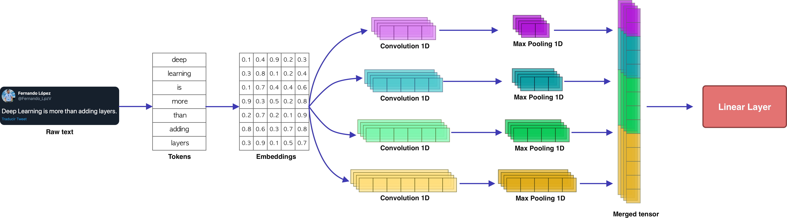

<!-- PROJECT SHIELDS -->
<!--
*** I'm using markdown "reference style" links for readability.
*** Reference links are enclosed in brackets [ ] instead of parentheses ( ).
*** See the bottom of this document for the declaration of the reference variables
*** for contributors-url, forks-url, etc. This is an optional, concise syntax you may use.
*** https://www.markdownguide.org/basic-syntax/#reference-style-links
-->
[![Medium][medium-shield]][medium-url]
[![Twitter][twitter-shield]][twitter-url]
[![Linkedin][linkedin-shield]][linkedin-url]

# Text Classification with CNNs in PyTorch
The aim of this repository is to show a baseline model for text classification through convolutional neural networks in the PyTorch framework. The architecture implemented in this model was inspired by the one proposed in the paper: <a href="https://arxiv.org/pdf/1408.5882.pdf">Convolutional Neural Networks for Sentence Classification</a>.

If you want to understand the details about how this model was created, take a look at this very clear and detailed explanation: <a href="https://medium.com/@fer.neutron/text-classification-with-cnns-in-pytorch-1113df31e79f?sk=12e7c4b3092297ee0e1c71d659297043"> Text Classification with CNNs in PyTorch </a>

<!-- TABLE OF CONTENTS -->
## Table of Contents

* [The model](#the-model)
* [Files](#files)
* [How to use](#how-to-use)
* [Contributing](#contributing)
* [Contact](#contact)
* [License](#license)

<!-- the-model -->
## 1. The model
The architecture of the model is composed of 4 convolutional layers which generate 32 filters each, then each one of these filters is passed through the ``max pooling`` function whose outputs are subsequently cocatenated. Finally, the concatenation is passed through a fully connected layer. The following image describes the model architecture:

<p align="center">

</p>

<!-- files -->
## 2. Files
* **Pipfile**: Here you will find the dependencies that the model needs to be run.

* **main.py**: It contains the controller of pipelines (preprocessing and trainig)

* **src**: It contains three directories, which are: ``model``, ``parameters`` and ``preprocessing``.

* **src/model**: It contains two files, ``model.py`` and ``run.py`` which handles the model definition as well as the training/evaluation phase respectively.

* **src/parameters**: It contains a ``dataclass`` which stores the parameters used to preprocess the text, define and train the model. 

* **src/preprocessing**: It contains the functions implemented to load, clean and tokenize the text.

* **data**: It contains the data used to train the depicted model. 

<!-- how-to-use -->
## 3. How to use
First you will need to install the dependencies and right after you will need to launch the ``pipenv`` virutal environment. So in order to install the dependices, you have to type:

```SH
pipenv install
```

right after you will need to launch the virtual environment such as:

```SH
pipenv shell
```

Then, you can execute the prepropcessing and trainig/evaluation pipelines easily, just typing:

```SH
python main.py
```

If you want to modify some of the parameters, you can modify the ``dataclass`` located at ``src/parameters/parameters.py`` which has the following form:

```PY
@dataclass
class Parameters:

   # Preprocessing parameeters
   seq_len: int = 35
   num_words: int = 2000
   
   # Model parameters
   embedding_size: int = 64
   out_size: int = 32
   stride: int = 2
   
   # Training parameters
   epochs: int = 10
   batch_size: int = 12
   learning_rate: float = 0.001
```
<!-- contributing -->
## 4. Contributing
Feel free to fork the model and add your own suggestiongs.

1. Fork the Project
2. Create your Feature Branch (`git checkout -b feature/YourGreatFeature`)
3. Commit your Changes (`git commit -m 'Add some YourGreatFeature'`)
4. Push to the Branch (`git push origin feature/YourGreatFeature`)
5. Open a Pull Request

<!-- contact -->
## 5. Contact
If you have any question, feel free to reach me out at:
* <a href="https://twitter.com/Fernando_LpzV">Twitter</a>
* <a href="https://medium.com/@fer.neutron">Medium</a>
* <a href="https://www.linkedin.com/in/fernando-lopezvelasco/">Linkedin</a>
* Email: fer.neutron@gmail.com

<!-- license -->
## 6. License
Distributed under the MIT License. See ``LICENSE.md`` for more information.


<!-- MARKDOWN LINKS & IMAGES -->
<!-- https://www.markdownguide.org/basic-syntax/#reference-style-links -->
[medium-shield]: https://img.shields.io/badge/medium-%2312100E.svg?&style=for-the-badge&logo=medium&logoColor=white
[medium-url]: https://medium.com/@fer.neutron
[twitter-shield]: https://img.shields.io/badge/twitter-%231DA1F2.svg?&style=for-the-badge&logo=twitter&logoColor=white
[twitter-url]: https://twitter.com/Fernando_LpzV
[linkedin-shield]: https://img.shields.io/badge/linkedin-%230077B5.svg?&style=for-the-badge&logo=linkedin&logoColor=white
[linkedin-url]: https://www.linkedin.com/in/fernando-lopezvelasco/